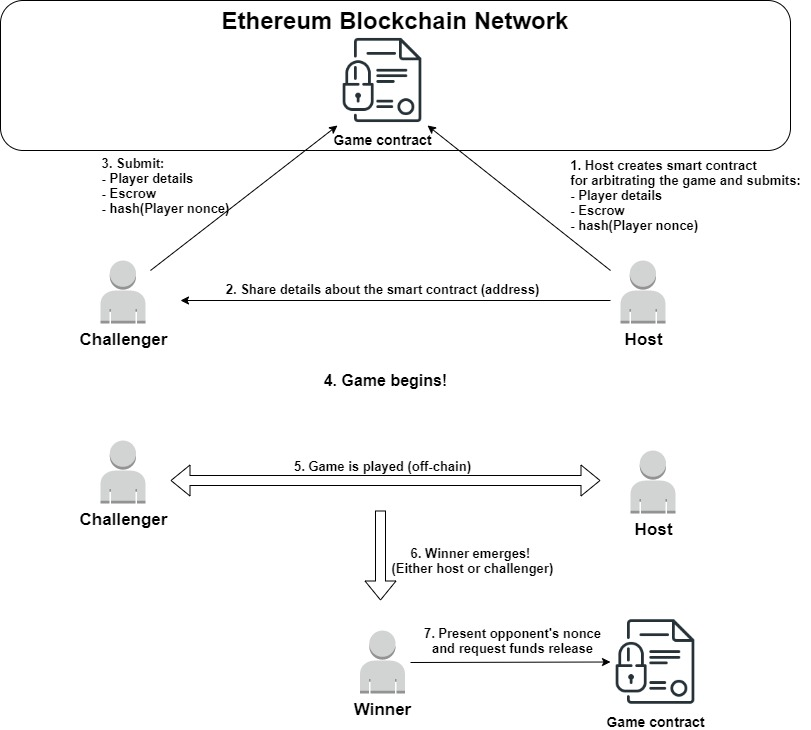
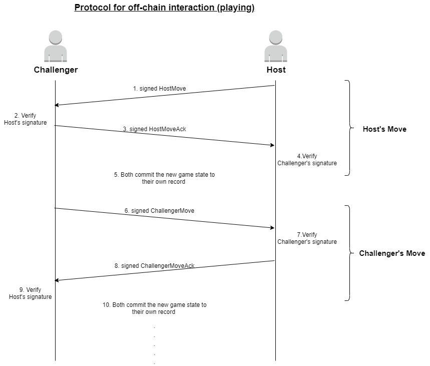
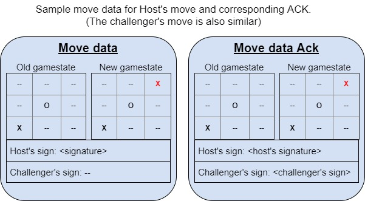
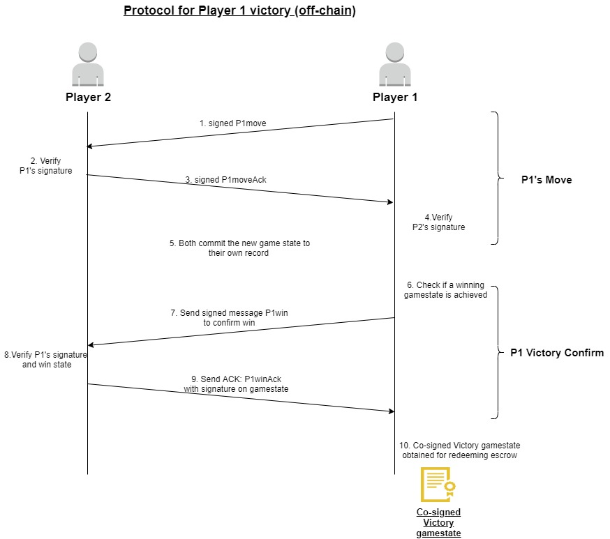
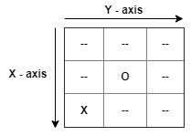

# State Channel Tic-tac-toe
---
Tic-Tac-Toe game over a state channel on Ethereum.

## Caveats:
---

1. In the current implementation, many things have been hardcoded in.
2. Griefing (players not cooperating, e.g. delaying respons to deny victory) and draws are not addressed yet.
3. The current implementation serves as a proof-of-concept more than anything else.
4. The UI is through the terminal window and can be a bit unwieldy.
5. Live Ethereum blockchain network is not used, instead ganache-cli (Ethereum RPC cient) is used.

## Design
---

The challenger is implemented in client.js and is called 'client' in the code.


## Architecture:


## Protocol for off-chain interaction:

### Playing:

- Here, the first move is made by the host which is then followed up by the challenger's own move. 
- For each move, the other player checks the validity and then sends and acknowledgement back.
- The acknowledgement is simple the original move's data with the verifier's signature added in.
- Once both players have the move data duly signed by both of them, they update their local game state with it.
- This continutes until an end is reached (draw or win).



The move data and the corresponding acknowledgement can be logically represented as follows:



### Victory / End:

When the game reaches its conclusion, there wil either be a draw or a victory. In either case, each player can present the final gamestate and the smart contract will release funds accordingly. 

In a victory, an additional confirmation is to be obtained from the other player. The protocol for a victory is as such:

Note: Draw scenario is not implemented in current version, only victories.

*Player 1 and Player 2 may either be Host or Challenger.*



## Escrow Redemption:

At the beginning of the game, both players submit the hash digest of their personal nonces [```hash(playerNonce)```]. When a player wins, the opponent should then hand over their nonce to the winner via the playerWinAck message who can then present this to the smart contract in order to redeem the escrow value. Therefore, the extra confirmation for victory is required in order to exchange the nonce from the loser to the winner.

## Dispute settlement:

*(This section is currently unimplemented and requires further development.)*

The general idea is that if there is a dispute, a player may ask the contract to release the funds to the player unless the other player responds by advancing the game.

In the current implementation, it is assumed that no disputes occur and both players play in good faith (optimistic scenario) and all games end in a victory for someone.


## Instructions on how to play (or run):
---

### Preparations:
1. Make sure node.js and npm are installed.
2. Install ganache-cli if not already installed.
3. Clone / copy  this repository to your local system.

### Starting:  

4. Start ganache-cli  
5. Navigate to repository on your device.  
6. Run node host.js in a new terminal  
  Note: This is the first player to move once the game has been setup (**Host**). The mark for this player is 'X'.
7. Run client.js in a new terminal  
  Note: This is the second player to move once the game has been setup (**Challenger**). The mark for this player is 'O'.

### Playing:  

#### Controls:
The game is basically on a 3x3 array, with each spot denoting a position on a tic tac toe grid.  


 
To make a move, enter the coordinates of the positon, e.g. enter '00' to place mark at (0,0).

1. The player 1 must make the first move.
2. Next, player 2 ... and so on.
3. When someone wins, the funds are automatically transferred, i.e. no special instructions are required to redeem funds. 

Note: In current implementation, the initial escrow funds are hardcoded. Player1 : 10, Player2 : 20
